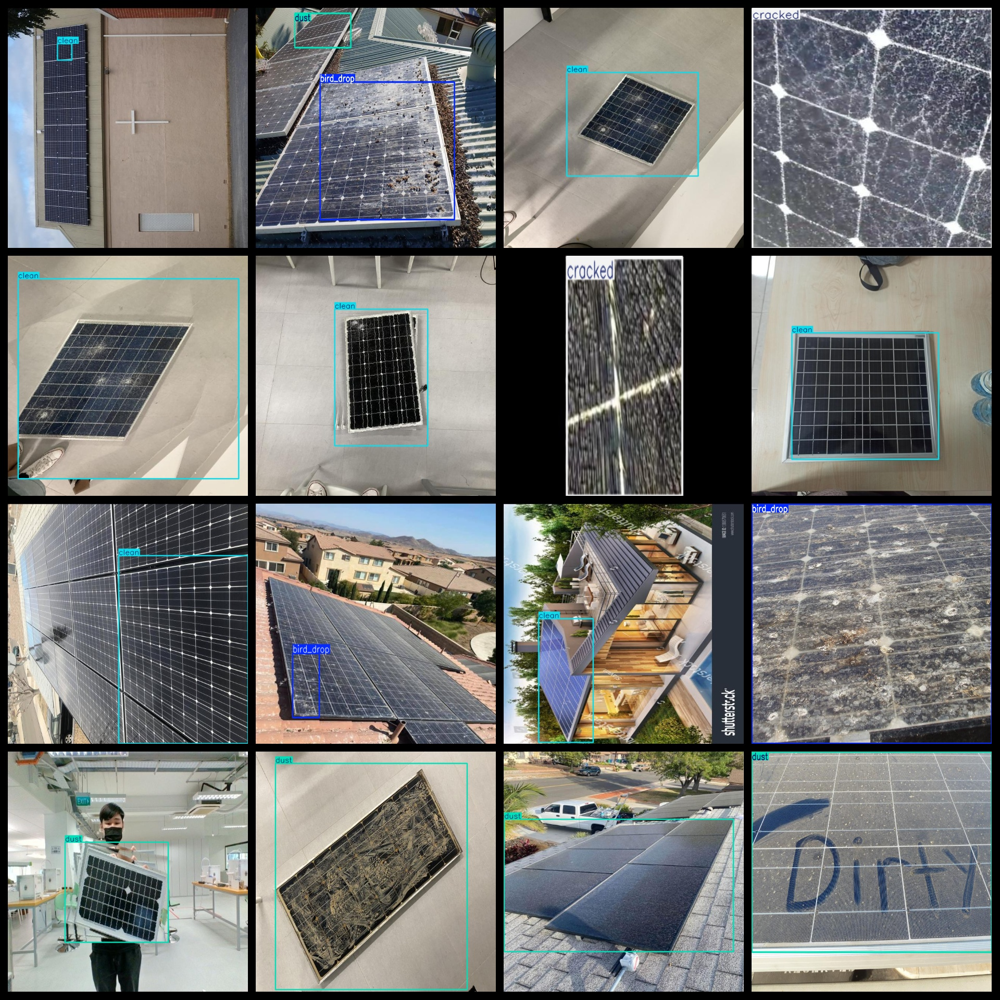
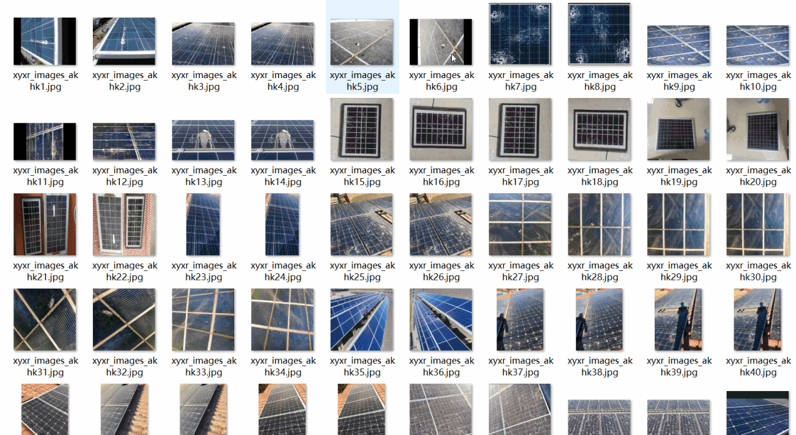

# [Object Detection] Sun Energy board Surface Dirty Crack Detection Dataset 4982 imagesYOLO+VOC

Dataset Format: VOC format + YOLO format

The compressed file contains: three folders, each storing images, xml files, and text files.

Total jpg images in JPEGImages folder: 4982

Total number of XML files in the Annotations folder: 4982

The total number of txt files in the labels folder is 4982.

Number of tag categories: 4

Tag names: ["bird_drop","clean","cracked","dust"]

The number of boxes for each label (Note that the order of labels in the Yolo format does not correspond to this, but is based on the classes.txt file in the labels folder):

bird_drop frame count = 2118

clean frame count = 1860

cracked frame count = 1832

dust frame count = 1568

Total boxes: 7378

Image clarity (resolution: pixels): Clear or average

Image Enhancement: Yes

Shape of the label: Rectangular box, used for object detection and recognition.

Important Note: None

Special Notice: This dataset does not guarantee the accuracy or precision of the trained models or weight files. The dataset only provides accurate and reasonable annotations.

Annotations

Picture overview

## Images

---

Here is a pay link on Stripe (https://buy.stripe.com/3cs8yP7sY87d0vu9AB). Please contact me lonlonago@foxmail.com after funding $89, and I will send you a complete data files, thank you!

